# Ethora Theme — Block Catalog

Ready-made, reusable sections. **Reuse these instead of inventing new layouts.**
Each renders via `get_template_part()`. All are tokenised (`css/tokens.css`),
self-contained (ship their own CSS once per request) and responsive.

Class prefixes are intentionally short and project-specific (`shs-` = self-hosted
server origin, `ppc-` = pricing, `tc-`/`tcar` = testimonials, `cta-dark`, …). The
screenshots below show what each name actually looks like, so you don't have to
guess from the markup.

> Live reference: every block here is used on **`page-self-hosted-server.php`**
> (URL `/self-hosted-chat-server-aws/`). Open it to see them in context.

---

## 1. Hero — `section-hero.php`

Page opener on the brand diagonal gradient: eyebrow + `<h1>` + lead + CTA buttons +
a green-check trust row on the left, a product visual (inline SVG or image) on the
right, decorative rhombus corners, and an optional compliance strip below. Clears the
fixed header via `--hero-pt`.

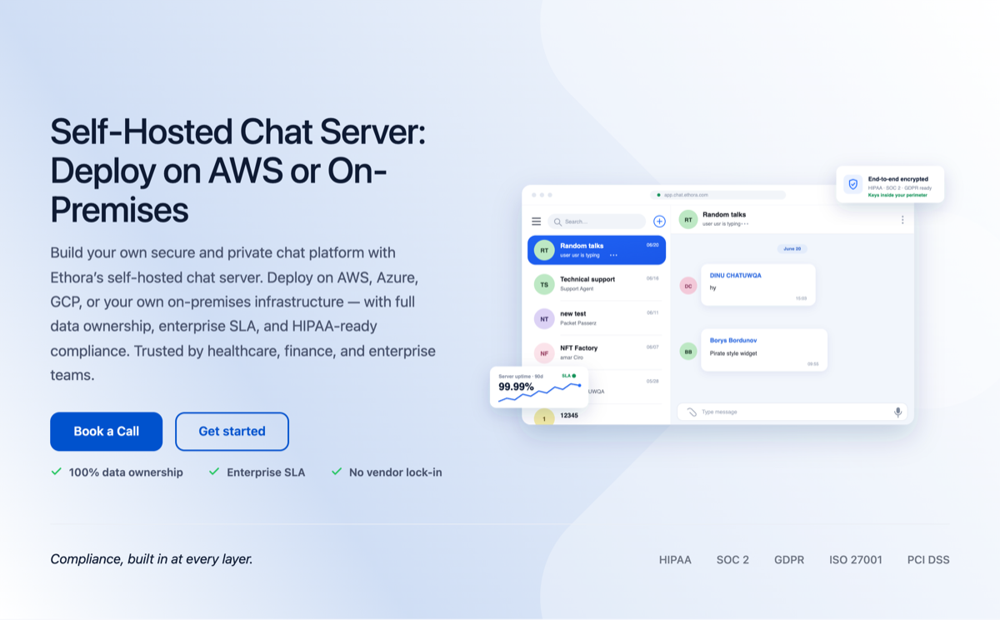

**Props**

| Prop | Type | Notes |
|---|---|---|
| `eyebrow` / `title` / `lead` | string | `title` → `<h1>`; all inline-HTML-friendly |
| `buttons` | array | each: `label`, `style` (`primary`/`outline`/`light`/`ghost`), `url`, `new_tab`, `id`, or `modal: true` (renders a `.book-demo-button` that opens the Book-a-Call modal) |
| `trust` | array | green-check items (strings) |
| `media` | string | theme-relative path or URL — `.svg` is **inlined** (smooth GPU compositing), raster → `` |
| `media_alt` / `media_width` / `media_height` / `media_html` | | raster alt+dims, or raw markup override |
| `rhombus` | bool | decorative corner shapes (default `true`) |
| `compliance` | array | `{ label, items[] }` — bottom strip (optional) |

```php
get_template_part( 'template-parts/section-hero', null, array(
  'title'   => 'Self-Hosted Chat Server: Deploy on AWS or On-Premises',
  'lead'    => 'Build your own secure and private chat platform…',
  'buttons' => array(
    array( 'label' => 'Book a Call', 'style' => 'primary', 'modal' => true ),
    array( 'label' => 'Get started', 'style' => 'outline', 'url' => 'https://app.chat.ethora.com/register', 'new_tab' => true, 'id' => 'accregred' ),
  ),
  'trust'      => array( '100% data ownership', 'Enterprise SLA', 'No vendor lock-in' ),
  'media'      => 'images/hero-chat.svg',
  'compliance' => array( 'label' => 'Compliance, built in at every layer.', 'items' => array( 'HIPAA', 'SOC 2', 'GDPR' ) ),
) );
```

---

## 2. Split card — `section-split-card.php`

Brand-gradient card with a heading + paragraphs on one side and an image on the
other. `reverse` puts the image on the left.


Reversed (`'reverse' => true`):

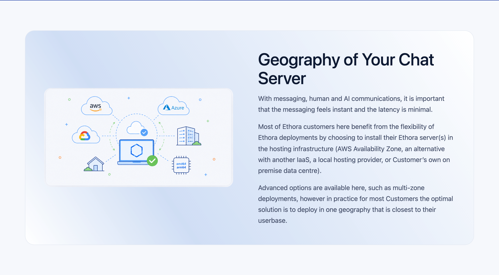

**Props**

| Prop | Type | Notes |
|---|---|---|
| `eyebrow` | string | optional mono kicker |
| `title` | string | h2 (inline HTML allowed) |
| `paragraphs` | array | one `<p>` per item (inline HTML allowed) |
| `image` | string | theme-relative path (`images/foo.png`) or absolute URL — optional |
| `image_alt` / `image_width` / `image_height` | string/int | alt + CLS dimensions |
| `reverse` | bool | `true` = image on the LEFT |

```php
get_template_part( 'template-parts/section-split-card', null, array(
  'title'        => 'Geography of Your Chat Server',
  'paragraphs'   => array( 'First paragraph.', 'Second paragraph.' ),
  'image'        => 'images/self-hosted-chat-server-aws-why-two.png',
  'image_alt'    => 'Deploy close to your userbase across regions',
  'image_width'  => 1733, 'image_height' => 907,
  'reverse'      => true,
) );
```

---

## 3. Blue statement band — `section-split-card.php` (`dark: true`)

A **full-bleed** brand dark-blue section (the `.shs-dark` treatment: deep `--primary-dark`
#002398 over the brand image) with a heading + paragraphs in white. The colour runs
edge-to-edge — background **and** side gutters are blue — while the text stays aligned to
the content container. It's the `dark` variant of the split card: pass `'dark' => true`
(usually without an image, for a bold statement / section divider).

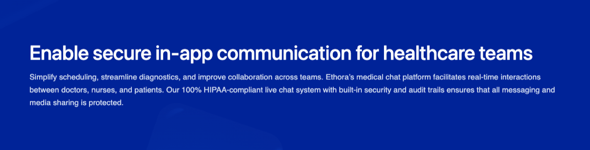

**Props** — same as Split card (#2) plus:

| Prop | Type | Notes |
|---|---|---|
| `dark` | bool | `true` = full-bleed brand dark-blue section, white text (eyebrow → `--accent-on-dark`, links → white) |

```php
get_template_part( 'template-parts/section-split-card', null, array(
  'title'      => 'Enable secure in-app communication for healthcare teams',
  'paragraphs' => array( 'One bold statement paragraph…' ),
  'dark'       => true,
) );
```

---

## 4. Key features — `section-key-features.php`

Interactive accordion: one item open at a time, auto-cycles with a progress
loader at the bottom of the open card (the loader drives the switch), product
image on the side. Click selects an item; height is fixed to the tallest item so
it never jumps. `reverse` flips sides. Supports multiple instances per page.

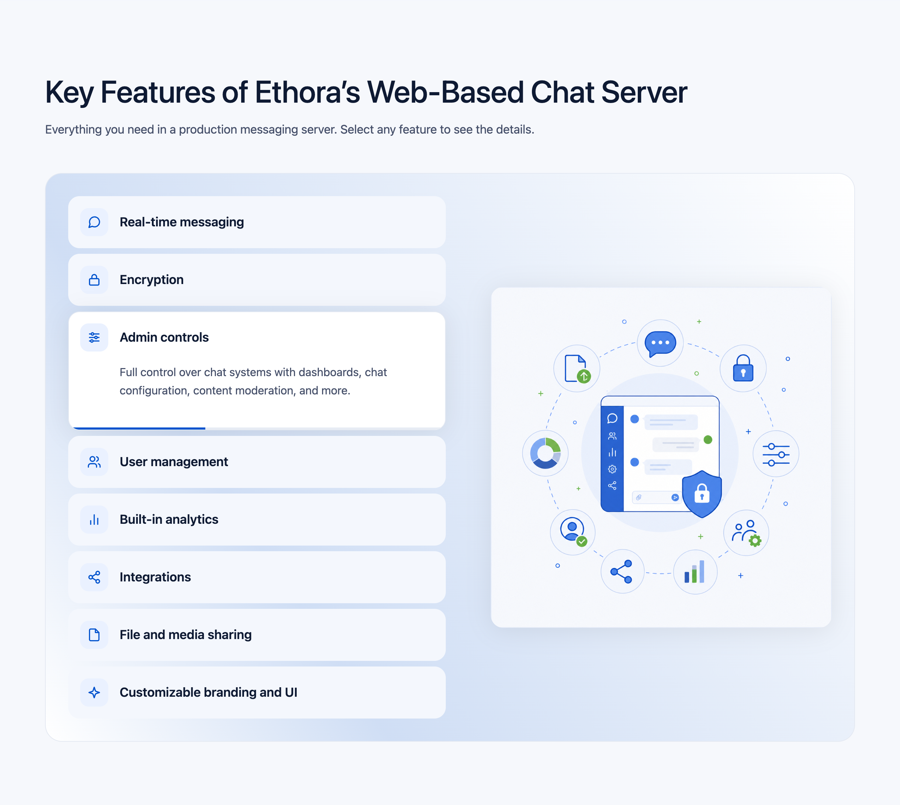

Reversed + text-only rows (no icons):


**Props**

| Prop | Type | Notes |
|---|---|---|
| `eyebrow` / `title` / `lead` | string | header (all optional) |
| `image` / `image_alt` / `image_width` / `image_height` | | side image (optional) |
| `interval` | number | seconds per item (default `4.2`) |
| `reverse` | bool | image on the LEFT |
| `shade` | bool | tint section bg + hairline borders |
| `features` | array | **required**, any length — each: `title`, `text`, `icon` (raw SVG, optional) |

```php
$ic = 'width="22" height="22" viewBox="0 0 24 24" fill="none" stroke="#0052CD" stroke-width="2" stroke-linecap="round" stroke-linejoin="round"';
get_template_part( 'template-parts/section-key-features', null, array(
  'title'    => 'Key Features',
  'lead'     => 'Select any feature to see the details.',
  'image'    => 'images/foo.png', 'image_alt' => '…', 'image_width' => 881, 'image_height' => 779,
  'features' => array(
    array( 'title' => 'Real-time messaging', 'text' => 'Instant delivery…', 'icon' => '<svg '.$ic.'>…</svg>' ),
    // …any number; omit 'icon' for a text-only row
  ),
) );
```

---

## 5. Feature cards — `section-feature-cards.php`

Responsive grid of cards on the brand gradient: coloured circular icon + heading +
short text + optional "Learn more →" button. Auto-fit grid — works with any number
of cards.

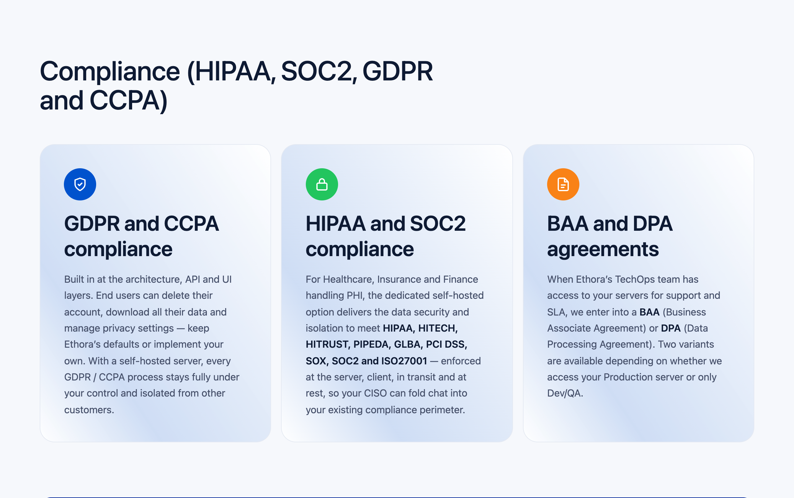

**Props**

| Prop | Type | Notes |
|---|---|---|
| `eyebrow` / `title` / `lead` | string | header (optional) |
| `shade` | bool | tint section bg |
| `cards` | array | **required** — each: `title`, `text` (inline HTML), `icon` (white line SVG, `stroke="currentColor"`), `color` (icon-circle colour token, default `var(--primary)`), `link_url` + `link_label` (optional → renders the button) |

```php
$ic = 'width="24" height="24" viewBox="0 0 24 24" fill="none" stroke="currentColor" stroke-width="2" stroke-linecap="round" stroke-linejoin="round"';
get_template_part( 'template-parts/section-feature-cards', null, array(
  'title' => 'Compliance (HIPAA, SOC2, GDPR and CCPA)',
  'cards' => array(
    array( 'title' => 'GDPR and CCPA', 'text' => '…', 'color' => 'var(--primary)', 'icon' => '<svg '.$ic.'>…</svg>' ),
    array( 'title' => 'HIPAA and SOC2', 'text' => '…', 'color' => 'var(--green)',   'icon' => '<svg '.$ic.'>…</svg>' ),
    array( 'title' => 'BAA and DPA',    'text' => '…', 'color' => 'var(--orange)',  'icon' => '<svg '.$ic.'>…</svg>',
           'link_url' => '/healthcare-chat-sdk/', 'link_label' => 'Learn more' ),
  ),
) );
```

Icon-circle colours come from tokens (`--primary`, `--green`, `--orange`, …). Keep
it restrained — don't turn it into a rainbow.

---

## 6. Link cards — `section-link-cards.php`

Responsive grid of cards (icon tile + heading + description + "Read more →"). On
hover the brand blue fills in from the bottom-right corner and the text/icon turn
white. Whole card is the link by default. Used for "Explore Related Solutions" and
ideal for any "related links / SDKs / industries" grid.

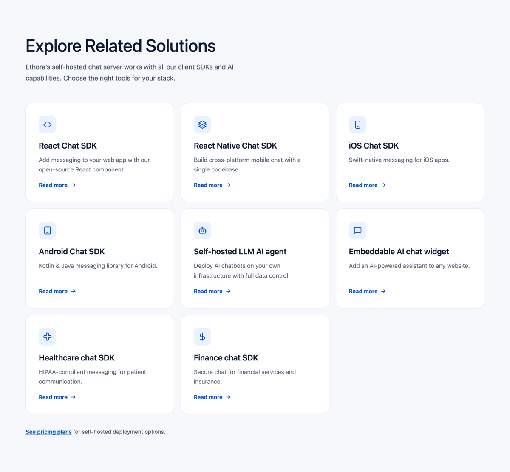

**Props**

| Prop | Type | Notes |
|---|---|---|
| `eyebrow` / `title` / `lead` | string | header (optional) |
| `shade` | bool | tint section bg |
| `card_as_link` | bool | default `true` (whole card clickable). Set **false** if a card's `text` contains its own `<a>` (avoids nested anchors) — then only "Read more" is the link |
| `footnote` | string | small paragraph under the grid (HTML, optional) |
| `cards` | array | **required** — each: `title`, `text` (inline HTML), `icon` (line SVG, optional), `url`, `link_label` (default "Read more") |

```php
$ic = 'width="22" height="22" viewBox="0 0 24 24" fill="none" stroke="#0052CD" stroke-width="2" stroke-linecap="round" stroke-linejoin="round"';
get_template_part( 'template-parts/section-link-cards', null, array(
  'title'    => 'Explore Related Solutions',
  'lead'     => 'Choose the right tools for your stack.',
  'footnote' => '<a href="/pricing/">See pricing plans</a> for self-hosted deployment options.',
  'cards'    => array(
    array( 'url' => '/chat-sdk/chat-sdk-reactjs-web', 'title' => 'React Chat SDK', 'text' => 'Add messaging to your web app.', 'icon' => '<svg '.$ic.'>…</svg>' ),
    // …any number
  ),
) );
```

> The "Flexible Architecture for Any Industry" grid on `page-self-hosted-server.php`
> uses the same visual design but is still inline (`.shs-ind-*`) — its card text
> contains in-text links, so it would use `'card_as_link' => false`. Migrate it to
> this partial when convenient.

---

## 7. Bento grid — *pattern* (inline on `page-self-hosted-server.php`)

Asymmetric bento: 2 large cards on top (a light brand-gradient card and a dark
`.shs-dark` card, each with a screenshot "peeking" out of the bottom-right corner) +
3 cards below (white text card + two media tiles). Big heading, bullet list inside.

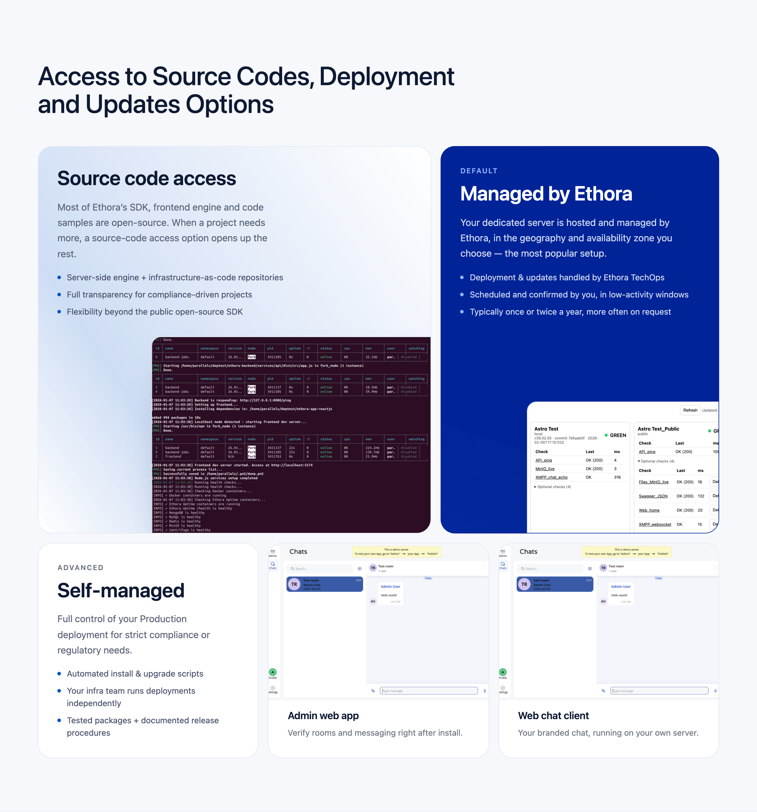

Not yet a partial — it lives inline in the DEPLOYMENT (07) section of
`page-self-hosted-server.php` (search `shs-bento-grid`). Lift it into
`section-bento.php` when a second page needs it; the markup + scoped `<style>` are
self-contained and ready to parametrise.

---

## 8. Dark CTA — `section-cta-dark.php`

Brand `.shs-dark` panel (deep `--primary-dark` over `start-free.png`) with eyebrow /
heading / text / buttons. **Use this for EVERY dark CTA / Book-a-Call block** — never
hand-roll a near-black panel.

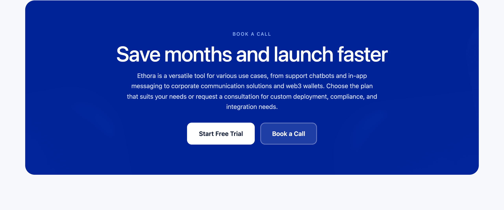

```php
get_template_part( 'template-parts/section', 'cta-dark', array(
  'eyebrow' => 'Book a call',
  'heading' => 'Save months and launch faster',
  'text'    => '…',
  'id'      => 'book-a-call',
  'buttons' => array(
    array( 'label' => 'Start Free Trial', 'url' => '…', 'style' => 'light' ),
    array( 'label' => 'Book a Call',      'url' => '…', 'style' => 'ghost' ), // or 'modal' => true
  ),
) );
```

---

## 9. Pricing cards — `section-pricing-cards.php`

Three pricing cards, middle highlighted, Monthly/Yearly toggle. Prices live in the
`$pp_plans` array inside the partial (edit in one place).

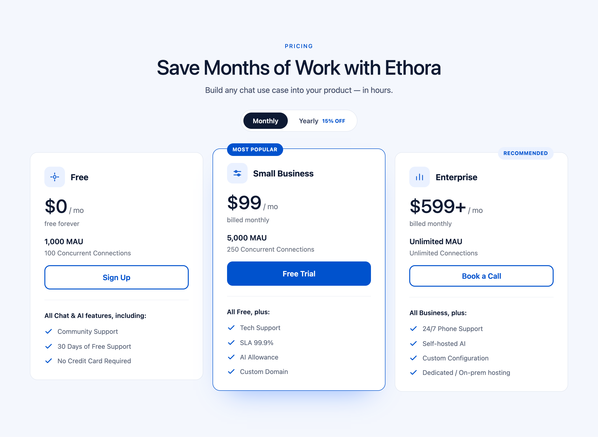

**Params:** `eyebrow`, `heading`, `subheading`, `show_header` (bool — false when the
page already has a hero heading), `bg` (`'alt'` | `'white'` | `'none'`).
`section-pricing.php` wraps it for an in-page section; `page-pricing.php` wraps it for
the full pricing page.

---

## 10. Testimonials carousel — `section-testimonials-carousel.php`

Auto-advancing carousel: 3 cards (2 on tablet, 1 on mobile), infinite loop, prev/next
buttons.

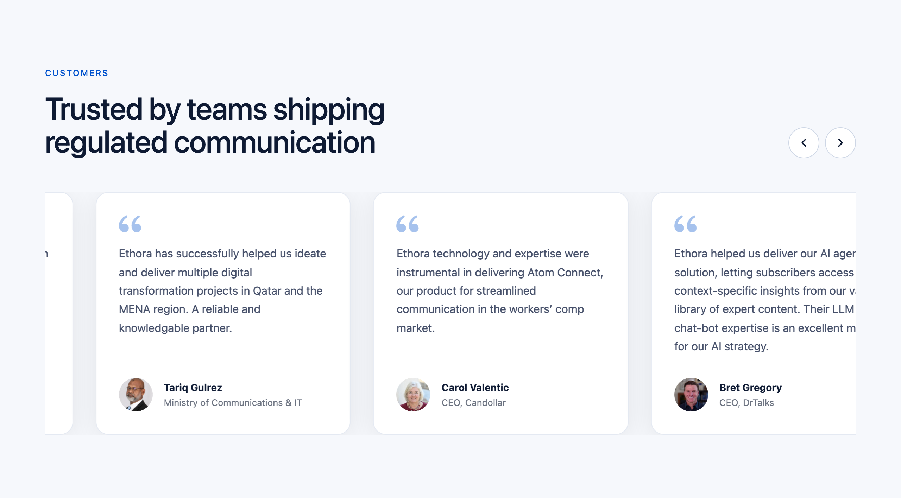

**Params:** `eyebrow`, `heading`, `interval` (ms, default 5000).

---

## 11. Case studies — `section-case-studies.php`

Row of case-study cards.

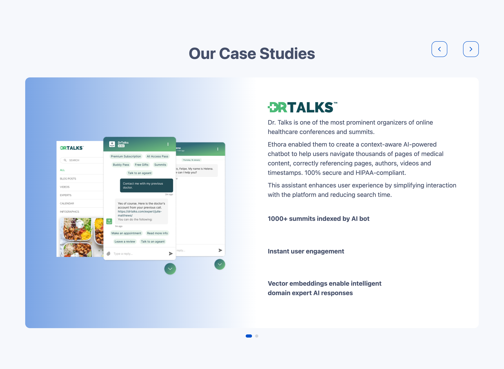

---

## Other partials

List everything with `ls template-parts/` and read each file's top docblock for its
params: `section-choose-app`, `section-use-kit`, `section-quick-start`,
`section-pricing`, `section-cta`, `section-testimonials`, `section-book-call-modal`.

---

## How these screenshots were made

Local must be running. From the theme root:

```bash
# playwright + system Chrome; hide the fixed .header so it doesn't overlap;
# screenshot each block by CSS selector. See the script used in the repo history.
node <script>.mjs ".claude/skills/ethora-theme/references/screenshots"
# then downsize: sips --resampleWidth 1200 screenshots/*.png
```

Selectors: `.shs-split-section`, `.shs-kf-section`, `.shs-fc-section`,
`section:has(.shs-bento-grid)`, `.cta-dark`, `.ppc`, `.tcar`, `.case-studies`.
Re-run after editing a block to refresh its screenshot.
