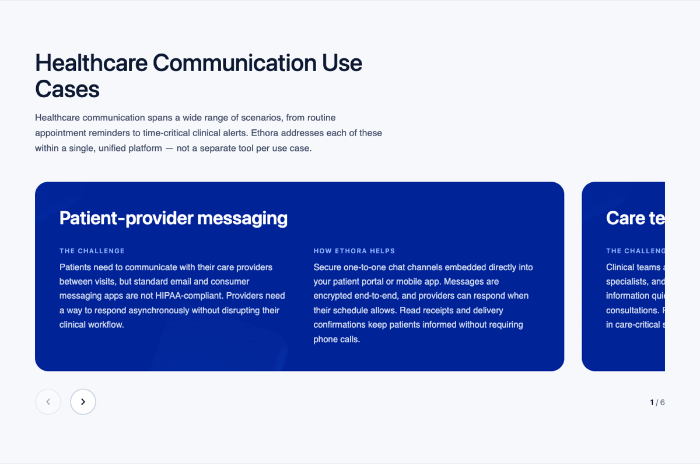
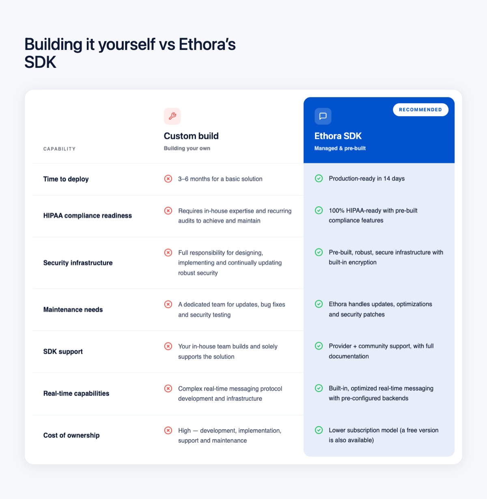
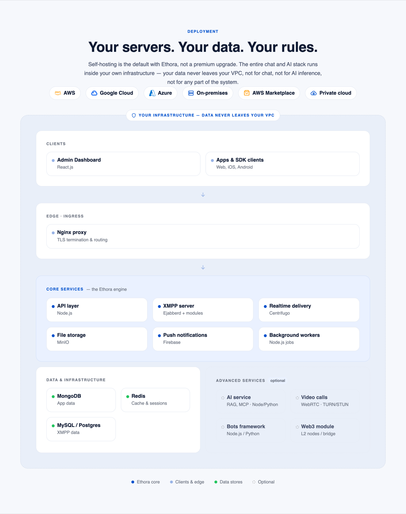
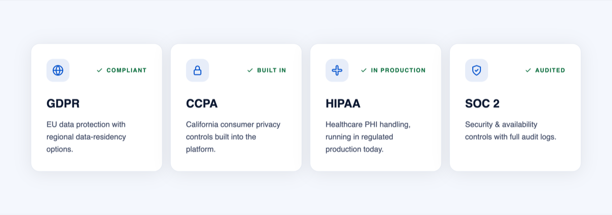
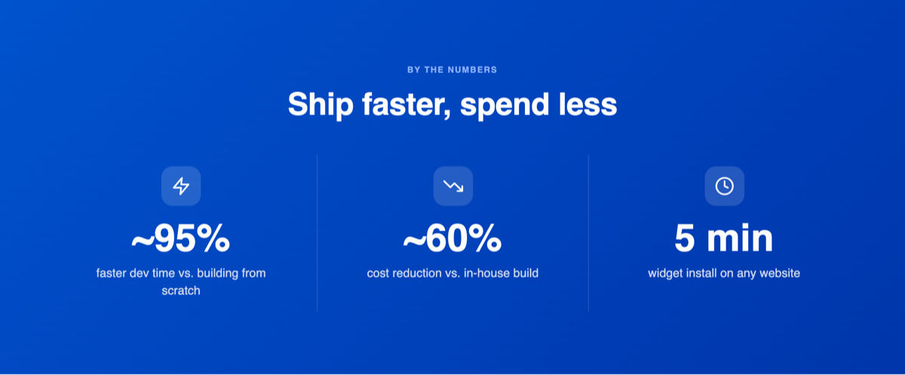
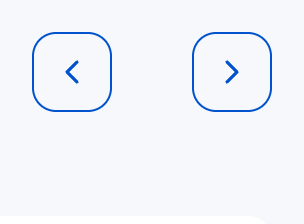

# Ethora Theme — Block Catalog

Ready-made, reusable sections. **Reuse these instead of inventing new layouts.**
Each renders via `get_template_part()`. All are tokenised (`css/tokens.css`),
self-contained (ship their own CSS once per request) and responsive.

Class prefixes are intentionally short and project-specific (`shs-` = self-hosted
server origin, `ppc-` = pricing, `tc-`/`tcar` = testimonials, `cta-dark`, …). The
screenshots below show what each name actually looks like, so you don't have to
guess from the markup.

> Live reference: every block here is used on **`page-self-hosted-server.php`**
> (URL `/self-hosted-chat-server-aws/`). Open it to see them in context.

---

## 1. Hero — `section-hero.php`

Page opener on the brand diagonal gradient: eyebrow + `<h1>` + lead + CTA buttons +
a green-check trust row on the left, a product visual (inline SVG or image) on the
right, decorative rhombus corners, and an optional compliance strip below. Clears the
fixed header via `--hero-pt`.


**Props**

| Prop | Type | Notes |
|---|---|---|
| `eyebrow` / `title` / `lead` | string | `title` → `<h1>`; all inline-HTML-friendly |
| `buttons` | array | each: `label`, `style` (`primary`/`outline`/`light`/`ghost`), `url`, `new_tab`, `id`, or `modal: true` (renders a `.book-demo-button` that opens the Book-a-Call modal) |
| `trust` | array | green-check items (strings) |
| `media` | string | theme-relative path or URL — `.svg` is **inlined** (smooth GPU compositing), raster → `` |
| `media_alt` / `media_width` / `media_height` / `media_html` | | raster alt+dims, or raw markup override |
| `rhombus` | bool | decorative corner shapes (default `true`) |
| `compliance` | array | `{ label, items[] }` — bottom strip (optional) |
| `full_height` | bool | `min-height: 100vh`, content vertically centred below the fixed header (default `true`; set `false` for a compact hero) |

```php
get_template_part( 'template-parts/section-hero', null, array(
  'title'   => 'Self-Hosted Chat Server: Deploy on AWS or On-Premises',
  'lead'    => 'Build your own secure and private chat platform…',
  'buttons' => array(
    array( 'label' => 'Book a Call', 'style' => 'primary', 'modal' => true ),
    array( 'label' => 'Get started', 'style' => 'outline', 'url' => 'https://app.chat.ethora.com/register', 'new_tab' => true, 'id' => 'accregred' ),
  ),
  'trust'      => array( '100% data ownership', 'Enterprise SLA', 'No vendor lock-in' ),
  'media'      => 'images/hero-chat.svg',
  'compliance' => array( 'label' => 'Compliance, built in at every layer.', 'items' => array( 'HIPAA', 'SOC 2', 'GDPR' ) ),
) );
```

---

## 2. Split card — `section-split-card.php`

Brand-gradient card with a heading + paragraphs on one side and an image on the
other. `reverse` puts the image on the left.


Reversed (`'reverse' => true`):


**Props**

| Prop | Type | Notes |
|---|---|---|
| `eyebrow` | string | optional mono kicker |
| `title` | string | h2 (inline HTML allowed) |
| `paragraphs` | array | one `<p>` per item (inline HTML allowed) |
| `image` | string | theme-relative path (`images/foo.png`) or absolute URL — optional |
| `image_alt` / `image_width` / `image_height` | string/int | alt + CLS dimensions |
| `reverse` | bool | `true` = image on the LEFT |
| `pad_top` / `pad_bottom` | string | optional vertical-padding overrides, e.g. `'var(--space-32)'` / `'48px'` (default = section rhythm) |

```php
get_template_part( 'template-parts/section-split-card', null, array(
  'title'        => 'Geography of Your Chat Server',
  'paragraphs'   => array( 'First paragraph.', 'Second paragraph.' ),
  'image'        => 'images/self-hosted-chat-server-aws-why-two.png',
  'image_alt'    => 'Deploy close to your userbase across regions',
  'image_width'  => 1733, 'image_height' => 907,
  'reverse'      => true,
) );
```

---

## 3. Blue statement band — `section-split-card.php` (`dark: true`)

A **full-bleed** brand-blue section (the brand gradient `brand-500 → brand-800`, same as
`.sb-section` / the cards-carousel cards) with a heading + paragraphs in white. The colour
runs edge-to-edge — background **and** side gutters are blue — while the text stays aligned
to the content container. It's the `dark` variant of the split card: pass `'dark' => true`
— either as a bold statement / section divider (no image) **or with an optional image
on either side** (`image` + `reverse`), same as the light split card but full-bleed dark.


**Props** — same as Split card (#2) plus:

| Prop | Type | Notes |
|---|---|---|
| `dark` | bool | `true` = full-bleed brand dark-blue section, white text (eyebrow → `--accent-on-dark`, links → white) |

```php
get_template_part( 'template-parts/section-split-card', null, array(
  'title'      => 'Enable secure in-app communication for healthcare teams',
  'paragraphs' => array( 'One bold statement paragraph…' ),
  'dark'       => true,
) );
```

---

## 4. Scroll-telling — `section-why.php`

A scroll-driven "telling" section: a **pinned** pane on the left (eyebrow + title + lead +
a changing image) and, on the right, a text track that slides up as you scroll — the image
swaps and the matching numbered step highlights at each threshold. On mobile it collapses to
a tap-to-open **accordion** (one step's image at a time). Self-contained (CSS + JS once),
supports multiple instances. Each step needs its own image.


**Props**

| Prop | Type | Notes |
|---|---|---|
| `eyebrow` / `title` / `lead` | string | pinned header (eyebrow + h2 + lead) |
| `numbered` | bool | show `01/02/03` markers (default `true`) |
| `rhombus` | bool | decorative background shape (default `true`) |
| `steps` | array | **required**, 2+ — each: `title`, `text` (inline HTML), `image` (path/URL, used desktop **and** mobile), `image_alt` |
| `frame` | bool | default `true` (card frame: shadow + radius + `cover`). Set **false** for self-framed images (own bg/shadow) → shows whole image (`contain`), no extra frame |

```php
get_template_part( 'template-parts/section-why', null, array(
  'eyebrow' => 'Why self-host with Ethora',
  'title'   => 'Full ownership without the operational burden',
  'lead'    => 'A self-hosted chat server is a messaging platform you deploy…',
  'steps'   => array(
    array( 'title' => 'Complete data ownership', 'text' => 'Full control over…',
           'image' => 'images/foo-one.png', 'image_alt' => '…' ),
    // …2+ steps, each with its own image
  ),
) );
```

Scroll length scales with step count (~60vh per step). Best for a short narrative of 3–5
steps where each has a supporting visual.

---

## 5. Key features — `section-key-features.php`

Interactive accordion: one item open at a time, auto-cycles with a progress
loader at the bottom of the open card (the loader drives the switch), product
image on the side. Click selects an item; height is fixed to the tallest item so
it never jumps. `reverse` flips sides. Supports multiple instances per page.


Reversed + text-only rows (no icons):


**Props**

| Prop | Type | Notes |
|---|---|---|
| `eyebrow` / `title` / `lead` | string | header (all optional) |
| `image` / `image_alt` / `image_width` / `image_height` | | side image (optional) |
| `interval` | number | seconds per item (default `4.2`) |
| `reverse` | bool | image on the LEFT |
| `shade` | bool | tint section bg + hairline borders |
| `features` | array | **required**, any length — each: `title`, `text`, `icon` (raw SVG, optional) |

```php
$ic = 'width="22" height="22" viewBox="0 0 24 24" fill="none" stroke="#0052CD" stroke-width="2" stroke-linecap="round" stroke-linejoin="round"';
get_template_part( 'template-parts/section-key-features', null, array(
  'title'    => 'Key Features',
  'lead'     => 'Select any feature to see the details.',
  'image'    => 'images/foo.png', 'image_alt' => '…', 'image_width' => 881, 'image_height' => 779,
  'features' => array(
    array( 'title' => 'Real-time messaging', 'text' => 'Instant delivery…', 'icon' => '<svg '.$ic.'>…</svg>' ),
    // …any number; omit 'icon' for a text-only row
  ),
) );
```

---

## 6. Feature cards — `section-feature-cards.php`

Responsive grid of cards on the brand gradient: coloured circular icon + heading +
short text + optional "Learn more →" button. Auto-fit grid — works with any number
of cards.


**Props**

| Prop | Type | Notes |
|---|---|---|
| `eyebrow` / `title` / `lead` | string | header (optional) |
| `shade` | bool | tint section bg |
| `cards` | array | **required** — each: `title`, `text` (inline HTML), `icon` (white line SVG, `stroke="currentColor"`), `color` (icon-circle colour token, default `var(--primary)`), `link_url` + `link_label` (optional → renders the button) |

```php
$ic = 'width="24" height="24" viewBox="0 0 24 24" fill="none" stroke="currentColor" stroke-width="2" stroke-linecap="round" stroke-linejoin="round"';
get_template_part( 'template-parts/section-feature-cards', null, array(
  'title' => 'Compliance (HIPAA, SOC2, GDPR and CCPA)',
  'cards' => array(
    array( 'title' => 'GDPR and CCPA', 'text' => '…', 'color' => 'var(--primary)', 'icon' => '<svg '.$ic.'>…</svg>' ),
    array( 'title' => 'HIPAA and SOC2', 'text' => '…', 'color' => 'var(--green)',   'icon' => '<svg '.$ic.'>…</svg>' ),
    array( 'title' => 'BAA and DPA',    'text' => '…', 'color' => 'var(--orange)',  'icon' => '<svg '.$ic.'>…</svg>',
           'link_url' => '/healthcare-chat-sdk/', 'link_label' => 'Learn more' ),
  ),
) );
```

Icon-circle colours come from tokens (`--primary`, `--green`, `--orange`, …). Keep
it restrained — don't turn it into a rainbow.

---

## 7. Link cards — `section-link-cards.php`

Responsive grid of cards (icon tile + heading + description + "Read more →"). On
hover the brand blue fills in from the bottom-right corner and the text/icon turn
white. Whole card is the link by default. Used for "Explore Related Solutions" and
ideal for any "related links / SDKs / industries" grid.


**Props**

| Prop | Type | Notes |
|---|---|---|
| `eyebrow` / `title` / `lead` | string | header (optional) |
| `shade` | bool | tint section bg |
| `card_as_link` | bool | default `true` (whole card clickable). Set **false** if a card's `text` contains its own `<a>` (avoids nested anchors) — then only "Read more" is the link |
| `footnote` | string | small paragraph under the grid (HTML, optional) |
| `cards` | array | **required** — each: `title`, `text` (inline HTML), `icon` (line SVG, optional), `url`, `link_label` (default "Read more") |

```php
$ic = 'width="22" height="22" viewBox="0 0 24 24" fill="none" stroke="#0052CD" stroke-width="2" stroke-linecap="round" stroke-linejoin="round"';
get_template_part( 'template-parts/section-link-cards', null, array(
  'title'    => 'Explore Related Solutions',
  'lead'     => 'Choose the right tools for your stack.',
  'footnote' => '<a href="/pricing/">See pricing plans</a> for self-hosted deployment options.',
  'cards'    => array(
    array( 'url' => '/chat-sdk/chat-sdk-reactjs-web', 'title' => 'React Chat SDK', 'text' => 'Add messaging to your web app.', 'icon' => '<svg '.$ic.'>…</svg>' ),
    // …any number
  ),
) );
```

> The "Flexible Architecture for Any Industry" grid on `page-self-hosted-server.php`
> uses the same visual design but is still inline (`.shs-ind-*`) — its card text
> contains in-text links, so it would use `'card_as_link' => false`. Migrate it to
> this partial when convenient.

---

## 8. Bento grid — *pattern* (inline on `page-self-hosted-server.php`)

Asymmetric bento: 2 large cards on top (a light brand-gradient card and a dark
`.shs-dark` card, each with a screenshot "peeking" out of the bottom-right corner) +
3 cards below (white text card + two media tiles). Big heading, bullet list inside.


Not yet a partial — it lives inline in the DEPLOYMENT (07) section of
`page-self-hosted-server.php` (search `shs-bento-grid`). Lift it into
`section-bento.php` when a second page needs it; the markup + scoped `<style>` are
self-contained and ready to parametrise.

---

## 9. Dark CTA — `section-cta-dark.php`

Brand `.shs-dark` panel (deep `--primary-dark` over `start-free.png`) with eyebrow /
heading / text / buttons. **Use this for EVERY dark CTA / Book-a-Call block** — never
hand-roll a near-black panel. Params: `eyebrow`, `heading`, `text`, `id`, `buttons`
(`label` / `url` / `style` `light`|`ghost` / `modal`), and **`wide`** (`true` = full-bleed
panel spanning the section width, only the 24px gutter — not capped at `--content-max`).


```php
get_template_part( 'template-parts/section', 'cta-dark', array(
  'eyebrow' => 'Book a call',
  'heading' => 'Save months and launch faster',
  'text'    => '…',
  'id'      => 'book-a-call',
  'buttons' => array(
    array( 'label' => 'Start Free Trial', 'url' => '…', 'style' => 'light' ),
    array( 'label' => 'Book a Call',      'url' => '…', 'style' => 'ghost' ), // or 'modal' => true
  ),
) );
```

---

## 10. Pricing cards — `section-pricing-cards.php`

Three pricing cards, middle highlighted, Monthly/Yearly toggle. Prices live in the
`$pp_plans` array inside the partial (edit in one place).


**Params:** `eyebrow`, `heading`, `subheading`, `show_header` (bool — false when the
page already has a hero heading), `bg` (`'alt'` | `'white'` | `'none'`).
`section-pricing.php` wraps it for an in-page section; `page-pricing.php` wraps it for
the full pricing page.

---

## 11. Testimonials carousel — `section-testimonials-carousel.php`

Auto-advancing carousel: 3 cards (2 on tablet, 1 on mobile), infinite loop, prev/next
buttons.


**Params:** `eyebrow`, `heading`, `interval` (ms, default 5000).

---

## 12. Case studies — `section-case-studies.php`

Row of case-study cards.


---

## 13. Cards carousel — `section-cards-carousel.php`

Title + lead on top, then a **full-width** track of dark brand cards: each card has a
**text column on the left and an image on the right**; the **active card is centred** and its neighbours **peek equally** on both sides (and scale up/down on switch). Switch with the **centred** prev/next buttons (the brand `.slider-btn`
standard) **or by dragging / swiping** (mouse and touch). Text blocks stack vertically and
are labelled. Best for use-cases or "challenge → solution" content. `'light' => true` for
white cards instead of dark.



**Props**

| Prop | Type | Notes |
|---|---|---|
| `eyebrow` / `title` / `lead` | string | header (optional) |
| `light` | bool | white cards instead of the default dark brand panel |
| `cards` | array | **required**, any length — each: `title`, `blocks` (array of `{ label, text }`, stacked), `image` + `image_alt` (right side, optional → text spans full width without it), optional `link_url` + `link_label` (CTA pill) |

Nav buttons follow the **slider/nav button RULE** (`.slider-btn`: 40px, `--radius-btn`,
`1px --primary` border, transparent, `--primary` chevron, hover `--primary-light`, centred).

```php
get_template_part( 'template-parts/section-cards-carousel', null, array(
  'title' => 'Healthcare Communication Use Cases',
  'lead'  => 'Ethora addresses each scenario within a single platform.',
  'cards' => array(
    array(
      'title' => 'Patient-provider messaging',
      'image' => 'images/foo.png', 'image_alt' => '…',
      'blocks' => array(
        array( 'label' => 'The challenge', 'text' => '…' ),
        array( 'label' => 'How Ethora helps', 'text' => '…' ),
      ),
    ),
    // …any number
  ),
) );
```

---

## 14. Comparison — `section-comparison.php`

A "build it yourself vs the recommended option" comparison: a capability column on the
left, a plain **negative** column (red ✕ per row) and a **highlighted brand-blue
recommended** column (green ✓ per row, solid-blue header, `RECOMMENDED` badge). Inside a
white card. Responsive: a 3-column grid on desktop that **reflows to per-row cards** on
mobile (column names repeat inside each option).



**Props**

| Prop | Type | Notes |
|---|---|---|
| `eyebrow` / `title` / `lead` | string | header (optional) |
| `capability_label` | string | small label over the left column (default `Capability`) |
| `col_a` | array | `{ title, subtitle, icon }` — the negative column (red ✕ rows) |
| `col_b` | array | `{ title, subtitle, icon, recommended }` — the highlighted column (green ✓ rows) |
| `rows` | array | **required** — each: `capability`, `a` (negative text), `b` (positive text) |

```php
get_template_part( 'template-parts/section-comparison', null, array(
  'title' => 'Building it yourself vs Ethora\'s SDK',
  'col_a' => array( 'title' => 'Custom build', 'subtitle' => 'Building your own', 'icon' => '<svg…wrench…>' ),
  'col_b' => array( 'title' => 'Ethora SDK', 'subtitle' => 'Managed & pre-built', 'recommended' => true, 'icon' => '<svg…>' ),
  'rows'  => array(
    array( 'capability' => 'Time to deploy', 'a' => '3–6 months…', 'b' => 'Production-ready in 14 days' ),
    // …
  ),
) );
```

The ✕ / ✓ row marks are built in (red / green). Keep it to two columns.

---

## 15. Feature spotlight — `section-feature-spotlight.php`

A "flagship + grid" feature layout: title + lead, then one big **flagship** card on a
brand-blue gradient (numbered `01`, label + heading + text + chips, with a built-in **chat
mockup** or an image on the right), followed by a grid of smaller **numbered white cards**
(`02`, `03` …) — tinted icon + heading + text. Responsive (flagship stacks, cards reflow).


**Props**

| Prop | Type | Notes |
|---|---|---|
| `eyebrow` / `title` / `lead` | string | header (optional) |
| `flagship` | array | `{ label, title, text, chips[], chat{ name,status,question,answer,file,avatar_icon } }` — or `image` + `image_alt` instead of `chat` |
| `items` | array | the smaller cards (numbered from 02) — each `{ icon (svg stroke="currentColor"), title, text }` |

```php
get_template_part( 'template-parts/section-feature-spotlight', null, array(
  'title'    => 'AI-Powered Healthcare Assistant',
  'lead'     => '…',
  'flagship' => array(
    'label' => 'Flagship capability', 'title' => 'Intelligent patient FAQ handling', 'text' => '…',
    'chips' => array( 'Trained on your docs', '24/7 answers' ),
    'chat'  => array( 'name' => 'Ethora Assistant', 'question' => 'What should I do before my MRI scan?',
                      'answer' => 'For your MRI: avoid metal jewelry…', 'file' => 'pre-op-guide.pdf' ),
  ),
  'items'    => array(
    array( 'icon' => '<svg…>', 'title' => 'Clinical query routing', 'text' => '…' ),
    // …
  ),
) );
```

---

## 16. Deployment stack — `section-deployment.php`

A centred header (eyebrow + title + lead), a row of platform chips (icon + label),
then a dashed **"your infrastructure" container** that lays an architecture diagram
out as native cards: stacked layer groups joined by down-arrows, a highlighted
brand-tinted **core** group, and a two-column row of side-by-side groups (data +
optional). Closes with a colour legend. Replaces a flat architecture PNG with an
on-brand, responsive, tokenised layout. Self-contained (CSS once per request).



**Props** — ALL optional; the defaults reproduce the Ethora self-hosted stack, so a
page usually overrides only `title` and `lead`.

| Prop | Type | Notes |
|---|---|---|
| `eyebrow` / `title` / `lead` | string | header (default eyebrow `Deployment`) |
| `platforms_label` | string | small label over the chips (default "The same stack, deployed anywhere") |
| `platforms` | array | each: `label`, `icon` (line SVG `stroke="currentColor"`, optional). Defaults to AWS/Google Cloud/Azure/On-premises/AWS Marketplace/Private cloud |
| `vpc_label` / `vpc_icon` | string | badge on the container top edge (default shield + "…data never leaves your VPC") |
| `groups` | array | the layers — each: `label`, `note`, `badge` (e.g. `optional`), `tint` (`'core'` = soft-brand bg), `dashed` (bool), `dot` (`core`\|`edge`\|`data`\|`optional` marker), `half` (bool → shares a row with adjacent half groups), `cols` (1–3 fixed card columns), `cards` (each `title` + `subtitle`) |
| `legend` | array | each: `label`, `dot` (same keys as group `dot`) |

Layout rule: consecutive `half` groups flow into one two-column row; full-width
groups stack, with a down-arrow drawn between two adjacent full-width layers.

```php
get_template_part( 'template-parts/section-deployment', null, array(
  'title' => 'Your servers. Your data. Your rules.',
  'lead'  => 'Self-hosting is the default with Ethora…',
  // groups/platforms/legend fall back to the Ethora stack defaults
) );
```

---

## 17. Compliance cards — `section-compliance-cards.php`

A responsive grid of white cards (**default 4-up**), each with a soft-blue rounded
icon tile and a green **"✓ STATUS"** tag on the top row, then a heading and a short
description. On hover the brand blue fills in from the bottom-right corner and the
contents turn white (same effect as Link cards #7). For trust/compliance strips (GDPR,
HIPAA, SOC 2 …); **omit `status` and it becomes a plain icon-card grid** (e.g. a
product-modules / "what you get" section — set `cols: 3` for six items). Self-contained
(CSS once per request); reflows to 2-up ≤900px, 1-up ≤560px.



**Props**

| Prop | Type | Notes |
|---|---|---|
| `eyebrow` / `title` / `lead` | string | optional centred header |
| `shade` | bool | tint the section bg + hairline borders |
| `cols` | int | desktop columns, 2–4 (default 4) |
| `cards` | array | **required** — each: `icon` (line SVG `stroke="currentColor"`, shown in the blue tile), `title`, `text` (inline HTML), `status` (optional — green ✓ tag, uppercased in CSS) |

```php
get_template_part( 'template-parts/section-compliance-cards', null, array(
  'shade' => true,
  'cards' => array(
    array( 'title' => 'GDPR', 'status' => 'Compliant', 'text' => 'EU data protection…', 'icon' => '<svg …>' ),
    array( 'title' => 'HIPAA', 'status' => 'In production', 'text' => 'Healthcare PHI…', 'icon' => '<svg …>' ),
    // …
  ),
) );
```

Status text uses `--success-strong` (AA green on white). Keep the icons as line SVGs
(`stroke="currentColor"`) — they inherit the brand-blue tile colour.

---

## 18. Stats band — `section-stats.php`

A **full-bleed brand-blue** section (the same gradient as the `.cc-section` cards:
`brand-500 → brand-800`) with an optional centred header and a row of flat stats
separated by thin dividers — each a translucent icon tile, a big white number and a
label. For "by the numbers" / impact strips. Self-contained (CSS once per request);
stacks to a single column (with top dividers) on mobile.



**Props**

| Prop | Type | Notes |
|---|---|---|
| `eyebrow` / `title` / `lead` | string | optional centred header (eyebrow → `--accent-on-dark`, heading white, lead `--text-on-dark`) |
| `stats` | array | **required** — each: `icon` (line SVG `stroke="currentColor"`, white in the glass tile), `value` (big number), `label` |

```php
$si = 'width="28" height="28" viewBox="0 0 24 24" fill="none" stroke="currentColor" stroke-width="2" stroke-linecap="round" stroke-linejoin="round"';
get_template_part( 'template-parts/section-stats', null, array(
  'stats' => array(
    array( 'value' => '~95%', 'label' => 'faster dev time', 'icon' => '<svg '.$si.'>…</svg>' ),
    array( 'value' => '5 min', 'label' => 'widget install',  'icon' => '<svg '.$si.'>…</svg>' ),
    // …
  ),
) );
```

Background is the brand-blue gradient shared with the cards carousel (`.cc-section`) —
never a near-black fill. Icon tiles / dividers use translucent white
(`rgba(255,255,255,.14/.16)`), the theme's established dark-panel pattern.

---

## Other partials

List everything with `ls template-parts/` and read each file's top docblock for its
params: `section-choose-app`, `section-use-kit`, `section-quick-start`,
`section-pricing`, `section-cta`, `section-testimonials`, `section-book-call-modal`.

`section-use-kit` (sticky illustration + benefits list) supports **`'sticky' => true`** (the
left image sticks while the list scrolls, like `.shs-whatis`) and **inline-SVG benefit icons**
(pass a raw `<svg stroke="#fff"…>` instead of a filename for a thematic icon on the blue tile).
Also: **`'outro_icon' => '<svg…>'`** renders the `outro` as a soft-blue **callout box** with the
icon (wrap the lead in `<strong>` for a bold kicker), and **`'modifier' => 'use-kit-cards'`** makes
each benefit row lift into a white card on hover (elevation + shadow).

---

## Core UI primitives (LOCKED — reuse exactly, never restyle)

Below the section blocks sit four **primitives**. Unlike blocks (which you compose),
these are the single canonical form for their job. There is exactly one of each — reuse
the class/markup verbatim; do **not** invent a variant, change the radius/colour, or
hand-roll a new one. All are tokenised.

> **The canonical CSS for the primitives ships in `css/primitives.css`.** Load it after
> `css/tokens.css` and use these exact classes — do **not** re-implement the rules in your
> own stylesheet. One import gives every consumer the brand's buttons, slider/nav buttons
> and toggle, wired to the tokens.
>
> ```html
> <link rel="stylesheet" href="css/tokens.css">
> <link rel="stylesheet" href="css/primitives.css">
> ```

### P1. CTA buttons — `.btn .btn-primary` / `.btn-outline`

The brand CTAs (Get started / Book a Call). Radius `--radius-btn` (12px), Open Sans 600.
Primary = `--primary` bg + white (hover `--primary-dark` + lift); outline = transparent +
`2px solid --primary` + primary text (hover `--primary-light`). On dark panels use
`.btn-light` (white bg) / `.btn-outline-light`.


```html
<a href="https://app.chat.ethora.com/register" class="btn btn-primary" id="accregred">Get started</a>
<a href="#" class="btn btn-outline book-demo-button">Book a Call</a>   <!-- opens the Book-a-Call modal -->
```

**CSS:** `css/primitives.css` (`.btn` + `.btn-primary` / `.btn-outline` / `.btn-light` /
`.btn-ghost`). In the live theme the same rules also exist in `css/index.css`; the
token-based partial variants (`.shs-btn*` in `section-hero`/`section-cta-dark`, `.ppc-btn`)
follow the identical spec. **Never** create a pill or other-radius CTA.

### P2. Slider / nav (switch) buttons — `.slider-btn`

Prev/next for **any** carousel or slider (as in *Our Case Studies*). 40px (2.5rem) square,
radius `--radius-btn` (12px), `1px solid --primary` border, transparent bg, `--primary`
chevron, hover → `--primary-light`, centred. On a dark/brand background add `.light`
(white border + chevron, hover translucent white).



```html
<div class="slider-controls">
  <button class="slider-btn prev" type="button" aria-label="Previous">
    <svg xmlns="http://www.w3.org/2000/svg" width="20" height="20" viewBox="0 0 24 24" fill="none" stroke="currentColor" stroke-width="2" stroke-linecap="round" stroke-linejoin="round"><path d="M15 18l-6-6 6-6"/></svg>
  </button>
  <button class="slider-btn next" type="button" aria-label="Next">
    <svg xmlns="http://www.w3.org/2000/svg" width="20" height="20" viewBox="0 0 24 24" fill="none" stroke="currentColor" stroke-width="2" stroke-linecap="round" stroke-linejoin="round"><path d="M9 18l6-6-6-6"/></svg>
  </button>
</div>
```

**CSS:** `css/primitives.css` (`.slider-controls`, `.slider-btn`, `.slider-btn.light`).
Always `type="button"` + `aria-label` (icon-only). **Never** invent another nav-button style.

### P3. Toggle switch — `.ppc-toggle` / `.ppc-tg`

Any binary/segmented toggle (Monthly/Yearly, tabs). A `--radius-pill` track on `--white`
with a `--border`; segments in Open Sans 600; the **active segment filled `--ink` + white
text**. An inline accent (e.g. a "15% OFF" tag) uses `--primary` (`--accent-on-dark` when active).


```html
<div class="ppc-toggle" role="group" aria-label="Billing period">
  <button type="button" class="ppc-tg active" data-bill="monthly">Monthly</button>
  <button type="button" class="ppc-tg" data-bill="yearly">Yearly <span class="ppc-off">15% OFF</span></button>
</div>
```

**CSS:** `css/primitives.css` (`.ppc-toggle`, `.ppc-tg`, `.ppc-off`); the block that uses it
wires the `.active` toggle in JS (see `section-pricing-cards.php`). **Never** build a bespoke switch/toggle.

### P4. Brand-blue section background — `--gradient-brand`

The single blue-fill background for a **full-bleed section**: token `--gradient-brand`
(`linear-gradient(135deg, var(--brand-500) 0%, var(--brand-800) 100%)`). Used by the Blue
statement band (#3), Cards carousel (#13 `.cc-section`), Stats band (#18 `.sb-section`) and
the Feature-spotlight flagship. White text on it: heading `#fff`, body `--text-on-dark`,
eyebrow `--accent-on-dark`.


```css
.my-section { background: var(--gradient-brand); padding: var(--section-y) var(--section-x); }
```

**Never** hand-write that `linear-gradient` inline — reference the token, so one edit
recolours every blue section. This is the *blue* fill; near-black is never allowed, and
dark/CTA panels use the separate `.shs-dark` image treatment (#9).

---

## How these screenshots were made

Local must be running. From the theme root:

```bash
# playwright + system Chrome; hide the fixed .header so it doesn't overlap;
# screenshot each block by CSS selector. See the script used in the repo history.
node <script>.mjs ".claude/skills/ethora-theme/references/screenshots"
# then downsize: sips --resampleWidth 1200 screenshots/*.png
```

Selectors: `.shs-split-section`, `.shs-kf-section`, `.shs-fc-section`,
`section:has(.shs-bento-grid)`, `.cta-dark`, `.ppc`, `.tcar`, `.case-studies`,
`.dep-section`, `.cmpl-section`, `.sb-section`.
Re-run after editing a block to refresh its screenshot.
